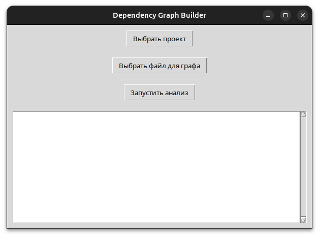
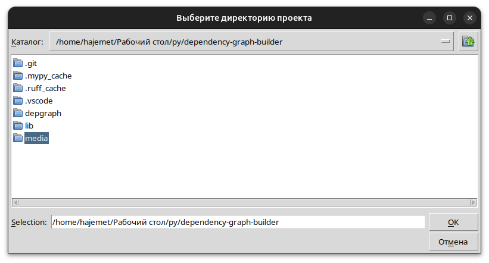
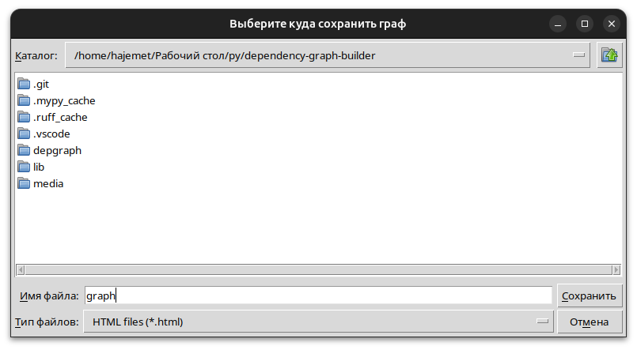
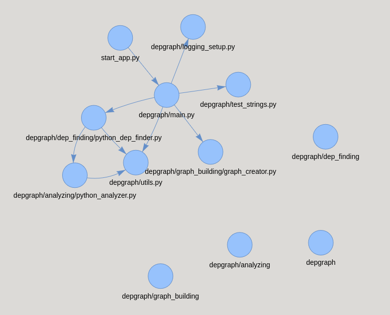

# dependency-graph-builder

Инструмент для построения графа зависимостей Python-проектов"

---

## Содержание

- [Установка Python](#установка_python)
- [Установка Python](#установка_проекта)
- [Использование](#использование)
- [Функционал](#функционал)
- [Примеры](#примеры)
- [Принцип работы](#принцип_работы)
- [Лицензия](#лицензия)

---

## Установка_Python

В проекте исполльзуется Python3.11

### Для Windows 
скачайте версию по [ссылке](https://www.python.org/ftp/python/3.11.9/python-3.11.9-amd64.exe)

### Для Linux 

установите командой:
```bash
sudo apt update
sudo apt install python3.11 python3.11-venv python3.11-tk python3.11-dev
```

### Для MacOS 

установите командой:
```bash
brew install python@3.11
brew install tcl-tk
```

## Установка_проекта

### Для Windows

1. Клонируем репозиторий и переходим в папку проекта:
```powershell
git clone https://github.com/HAJEMET-chan/dependency-graph-builder.git
Set-Location dependency-graph-builder
```

2. Создаем виртуальное окружение и устанавливаем зависимости:
```powershell
python3.11 -m venv venv
.\venv\Scripts\Activate.ps1
python -m pip install --upgrade pip
pip install -r requirements.txt
```

3. Активируем виртуальное окружение (если не было активировано):
```powershell
.\venv\Scripts\Activate.ps1
```

### Для Linux / macOS

1. Клонируем репозиторий и переходим в папку проекта:
```bash
git clone https://github.com/HAJEMET-chan/dependency-graph-builder.git
cd dependency-graph-builder
```
2. Создаем виртуальное окружение и устанавливаем зависимости:
```bash
python3.11 -m venv venv
source venv/bin/activate
python -m pip install --upgrade pip
pip install -r requirements.txt
```
3. Активируем виртуальное окружение (если не было активировано):
```bash
source venv/bin/activate
```

## Использование

запустите [start_app.py](start_app.py)
откроется окно приложения

## Функционал
(его отсутствие)



на главном окне всего 3 кнопки
1. **Выбрать проект**
    откроется окно выбора папки с исходным кодом проекта внутренные зависимости которого вы хотите посмотреть ввиде графа
2. **Выбратьфайл для графа**
    откроется окно для выбора директории файла графа и его названия
3. **Запустить анализ**
    собственно запускает анализ исходников

## Примеры

### Граф этого проекта


1. Нажимаем **Выбрать проект**
    - открывается окно выбора папки:
    - 
    - у меня проект расположен в `/home/hajemet/Рабочий стол/py/dependency-graph-builder` вы находите проект у себя в папках
    - выбираем это расположение и переходим дальше
2. Нажимаем **Выбратьфайл для графа**
    - открывается окно выбора папки куда сохранится граф и его названия:
    - 
    - опять же я сохраню в `/home/hajemet/Рабочий стол/py/dependency-graph-builder` но можно куда угодно
    - я дам название `graph.html` но можно любое разве что это должен быть `*.html` файл
    - выбираем это расположение и имя и переходим дальше
3. Нажимаем **Запустить анализ**
    - необходимо подождать пока анализ завершится
    - в зависимости от объема проекта для анализа может потребоваться довольно много времени но редко больше минуты
    - этот проект изза того что маленький парсится почти мгновенно
    - под конец анализа создастся файл там где вы указали и с назвением который вы указали
    - также откроется вкладка в браузере с графом
    - 
    - таким образом выглядит граф этого проекта
4. Исследуем интеракивный граф
    - 

(Note: для больших проектов это граф будет неимоверно глючить и при том непонятным
в будущих версиях я сделаю класный граф)

## Принцип_работы

### Запуск проги

- точка входа в приложение([start_app.py](start_app.py)) перенаправляет нас в файл [main.py](depgraph/main.py) в котором происходит инициализация окна приложения написанного на tkinter
    - точка входа вынесена за папку со всей логикой для более простого запуска программы путем команды `python start_app.py` или же `poetry run python start_app.py` если вы используете poetry как я, вместо громоздкого варианта `python -m depgraph.main`

    - `tkinter` для интерфейся был выбран по простой причине того что это самое начала проекта и сейчас хочется просто увидетьь результаты. Если б я использовал большие библиотеки на которых пишут интерфейсы то первая версия вышла бы на 2 недели позже

    - здесь после того как вы нажали **Запустить анализ** инициируются 2 экземпляра классов `PythonDepFinder`(файл: [python_dep_finder.py](depgraph/dep_finding/python_dep_finder.py)) и `GraphCreator`(файл: [graph_creator.py](depgraph/graph_building/graph_creator.py))
    ```python
    dep_finder = PythonDepFinder(self.project_path)
    graph_creator = GraphCreator()
    ```

    - после инициализаций этих экхемпляров по очереди сперва запускается поиск и анализ зависимостей `dep_finder.start_dep_finding()` а далее постройка графа на основе этих зависимостей `graph_creator.build_graph(dep_finder.get_dep_dict())`


